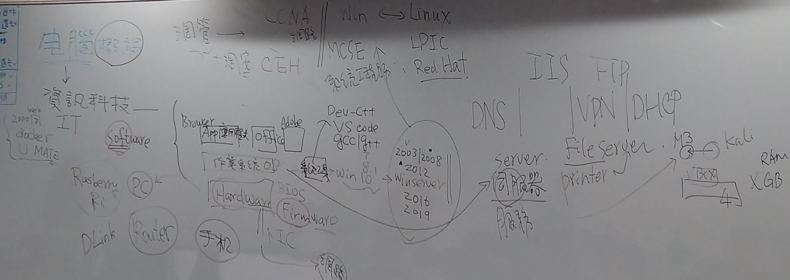
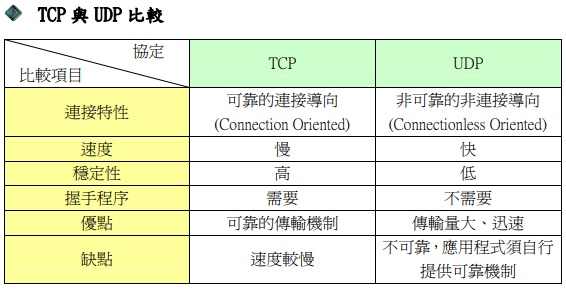

# computer netwokr計算機網路   網路概論


```
說明OSI Model與 TCP/IP protocol
```
##### OSI模型 (Open System Interconnection Model)
```
一種概念模型,由國際標準化組織提出,一個試圖使各種電腦在世界範圍內互連為網路的標準框架,定義於ISO/IEC 7498-1
```
分層|英文|中文|功能|位址|傳輸單位|舉例|各種協定
:-:|:-:|:-:|-|-|-|-|-|
7|Application Layer|應用層|**應用層直接和應用程式介面結合, 並提供常見的網路應用服務** ||||FTP、HTTP、TELNET、SMTP、POP3、DNS、RAS、DHCP、LDAP...等
6|Presentation Layer|表現層|**字元編碼, 資料格式轉換, 壓縮與解壓縮, 加密與解密** 負責將傳入來的資料種類轉換成PC的資料種類,對資料進行壓縮和加密以提高速度和增加安全性 |||| 
5|Session Layer|會談層| **控制計算機之間的對話(連接), 允許程式以電腦名稱註冊成為網路上唯一的位址** 負責電腦之間的信息同步,維護連結,監測資料溝通狀態,並對錯誤信息做出處理|||| 
4|Transport Layer|傳輸層|**進行資料的“分拆”和“打包, 如何控制節點間的傳遞﹐還有錯誤檢測和修正的方法**,資料的Fragmentation(分割)與Reassembly(重組),用**End-to-End** Connection(端點對端點連線),確保電腦資料正確的傳送到目的地|每個應用程式都會在網卡註冊一個埠號,該層就是埠與埠的通信,**port number(通訊埠編號)** |**segment(區段;TCP)** 、**User Datagram(使用者資料包; UDP)** 、**Message(信息; SCTP)** ||**TCP(傳輸控制協定),為三向交握（three-way handshake）** ,被稱為連接式協定、**UDP(用戶資料報協定)** ,被稱為非連接式協定 、**SCTP(串流控制傳輸協定),為四向交握（four-way handshake）** ...等
3|Network Layer|網路層|**基於IP位址傳遞Packed, 根據路由演算法(Rorting Algorithm)選擇路徑**,負責 MAC 位址 和 網路位址(如 IP 位址﹑IPX 位址)之間的轉換|**IP address(IP位址)** 網際協定版本 IPv4 使用32位元（4位元組）位址、IPv6 使用128位元|**Packed(封包)** = IP Datagram(IP 資料包)(IP表頭+資料)|Router(路由器)、IP Switch(IP 交換機)| **IP(網際網路協定)** 、IPsec(網際網路安全協定)、ICMP(網際網路控制訊息協定)...等
2|Data Link Layer|資料連結層|**框包的錯誤檢測, 傳送和接收順序與傳遞方式**,IEEE 802系列標準 將此層分為 **MAC(媒體訪問控制)** 與 **LLC(邏輯鏈路控制)** 子層,在LAN(區域網路)上面的信息單元被稱為 frame,每一個 frame 都會被賦予一個MAC位址 和checksum(偵錯監測值)| **MAC位址(Media Access Control Address,媒體存取控制層位址)** | **Frame(訊框)** (資料連結層標頭+資料+尾部(如果有的話))|**Switch(交換器)、Bridge(橋接器)**| **ARP(位址解析協定)、STP(生成樹協定)** 、PPP(對等協定)...等
1|Physical Layer|實體層|**定義物理媒介在網路傳輸中的各種設備的訊號與電氣特性規格** ,將硬體所攜載的信號轉換成電腦可以理解的電子信號(0 和 1)這通常都是設備上面之韌體(Firmware)的功能|不需要位址,其以**廣播方式傳播** |**位元(bit)**|針腳、**Hub(集線器)、Repeater(中繼器)** 、和傳輸由快到慢排序如**光纖、雙絞線、同軸電纜、電話線** ...等|
```
*encapsulation（封裝）在每層中,header（標頭）或是trailer（尾部）可加到資料單位裡
```
##### TCP/IP (TCP/IP Protocol Suite,TCP/IP協定套組)又被稱為TCP/IP協定疊（英語：TCP/IP Protocol Stack）
```
TCP/IP提供了點對點連結的機制,將資料應該如何封裝、定址、傳輸、路由以及在目的地如何接收,都加以標準化,它將軟體通訊過程抽象化為四個抽象層
```
分層|英文|中文|功能
:-:|:-:|:-:|-|
4|application layer|應用層|該層包括所有和應用程式協同工作,利用基礎網路交換應用程式專用的資料的協定,應用層是大多數普通與網路相關的程式為了通過網路與其他程式通訊所使用的層
3|transport layer|傳輸層|解決如 **端到端** 可靠性和保證資料按照正確的順序到達這樣的問題,在TCP/IP協定組中,傳輸協定也包括所給資料應該送給哪個應用程式
2|internetwork layer|網際網路層|	網路層解決在一個單一網路上傳輸封包的問題,牽涉到在網路組成的網上選擇路徑將封包傳輸
1|Network Access layer|網路存取層 |	它是封包從一個裝置的網路層傳輸到另外一個裝置的網路層的方法,這個過程能夠在網卡的軟體驅動程式中控制，也可以在韌體或者專用晶片中控制

# 協定protocol
```
何謂communications protocol[簡稱協定protocol]?
WHY Layering為何要分層?
```
```
1.Communication Protocol（通訊協定）定義電腦間互相通訊且受共同認定的協議標準,
  在一部電腦上可同時存在許多協定,並同時以不同的通訊協定和不同領域的電腦通訊
2.分層的原則是將來改變或更換某一層的通訊協定時,不會影響到其他層通訊協定的工作,
  層次不可太多,太多層的結構在整合的工作上較複雜且困難,
  相同功能之通訊協定歸於同一層,
  每一層之邊界只與上一層或下一層有關
```
## 各種協定
```
簡述下列協定protocol
須回答
(A)英文全名
(B)運作在那一層?
(C)主要功能
(D)相關工具或伺服器
```
### application層
```
HTTP vs HTTPS
FTP vs SFTP | FTPS
TELNET vs SSH
SMTP vs POP3 INAP 4

DNS vs DNSsec

DHCP

LDAP
SAMBA

SNMP

RTMP RTSP

MQTT
```
TCP/UDP埠列表: https://zh.wikipedia.org/wiki/TCP/UDP%E7%AB%AF%E5%8F%A3%E5%88%97%E8%A1%A8
```
位於L7應用層:

HTTP(超文本傳輸協定)HyperText Transfer Protocol
  是一種用於分佈式、協作式和超媒體訊息系統的應用層協定,HTTP是全球資訊網的數據通信的基礎
  伺服器: Google的Google Web Server
  Port： 80 
HTTPS(超文本傳輸安全協定)HyperText Transfer Protocol Secure
  開發的主要目的，是提供對網站伺服器的身分認證，保護交換資料的隱私與完整性
  Port： 443
FTP(檔案傳輸協定)File Transfer Protocol
  是一個用於在電腦網路上在客戶端和伺服器之間進行檔案傳輸的應用層協定
  Port： 21
SFTP(安全檔案傳送協定)Secure File Transfer Protocol [也稱 SSH檔案傳輸協定(SSH File Transfer Protocol)]
  一數據流連線，提供檔案存取、傳輸和管理功能的網路傳輸協定,可提供與FTP相同，但是更為安全的檔案傳輸服務
  Port： 22
FTPS
  是一種對常用的檔案傳輸協定（FTP）添加傳輸層安全（TLS）和安全通訊協定（SSL）加密協定支援的擴充協定
  Port: 隱式(Implicit):990 ,為了保持與現有的非FTPS感知客戶端的相容性，隱式FTPS預設在IANA規定的埠990/TCP上監聽FTPS控制通道
  Port: 顯式(Explicit):21 ,FTPS客戶端先與伺服器建立明文連接，然後從控制通道明確請求伺服器端升級為加密連接(Cmd: AUTH TLS)也可以使用未加密的原始FTP進行連接，也就是說伺服器在相同的埠上同時提供FTP與FTPS服務
TELNET(遠端登入)
  使用於網際網路及區域網中,使用虛擬終端機的形式，提供雙向、以文字字串為主的命令列介面互動功能,常用於伺服器的遠端控制,可供使用者在本地主機執行遠端主機上的工作
  Port: 107
SMTP(簡單郵件傳輸協定)Simple Mail Transfer Protocol
  是一個在網際網路上傳輸電子郵件的標準
  Port: 25
POP3(郵局協定)Post Office Protocol,POP,最新版本為3
  目前的POP3郵件伺服器大都可以「只下載郵件，伺服器端並不刪除」，也就是改進的POP3協定
  Port: 110
INAP4(網際網路資訊存取協定)Internet Message Access Protocol
  用來從本地郵件客戶端（如Microsoft Outlook、Outlook Express、Foxmail、Mozilla Thunderbird）存取遠端伺服器上的郵件
  伺服器 FQDN： mail.contoso.com
  Port: 143
DNS(網域名稱系統)Domain Name System
  是網際網路的一項服務,它作為將域名和IP位址相互對映的一個分散式資料庫,能夠使人更方便地存取網際網路
  Port: 53
DNSsec(域名系統安全擴充)Domain Name System Security Extensions
  Internet工程任務組(IETF)的對確保由域名系統(DNS)中提供的關於網際網路協定(IP)網路使用特定類型的資訊規格套件,它是對DNS提供給DNS客戶端(解析器)的DNS資料來源進行認證,並驗證不存在性和校驗資料完整性驗證,但不提供機密性和可用性
  Port: TCP 53 (DNS流量始終使用端口53。UDP數據包限制為512個字節，而DNSSEC數據包可以更大，並且TCP允許的數據包比UDP大得多)
DHCP(動態主機設定協定)Dynamic Host Configuration Protocol
  用於內部網路或網路服務供應商自動分配IP位址給用戶,和內部網路管理員對所有電腦作中央管理
  Port: 546
LDAP(輕型目錄存取協定)Lightweight Directory Access Protocol
  目錄服務在開發內部網路和與網際網路程式共享用戶、系統、網路、服務和應用的過程中占據了重要地位,例如，目錄服務可能提供了組織有序的記錄集合,通常有層級結構,例如公司電子郵件目錄.同理,也可以提供包含了位址和電話號碼的電話簿
  Port: 389
SAMBA(網路管理工具)
  是種用來讓UNIX系列的作業系統與微軟Windows作業系統的SMB/CIFS（Server Message Block/Common Internet File System）網路協定做連結的自由軟體
  Port: 901
SNMP(簡單網路管理協定)Simple Network Management Protocol
  構成了網際網路工程工作小組（IETF，Internet Engineering Task Force）定義的Internet協定族的一部分,該協定能夠支援網路管理系統,用以監測連接到網路上的裝置是否有任何引起管理上關注的情況.它由一組網路管理的標準組成,包含一個應用層協定（application layer protocol）,資料庫模式（database schema）,和一組資料物件
  Port: 162
RTMP(即時訊息協定)Real-Time Messaging Protocol
  是最初由Macromedia為通過網際網路在Flash播放器與一個伺服器之間傳輸串流媒體音訊、影片和資料而開發的一個專有協定.Macromedia後被Adobe Systems收購,該協定也已發布了不完整的規範供公眾使用
  Port: 1935
RTSP(即時串流協定)Real Time Streaming Protocol
  專為娛樂和通信系統的使用,以控制串流媒體伺服器,該協定用於建立和控制終端之間的媒體對談.媒體伺服器的客戶端發布VCR命令,例如播放、錄製和暫停,以便於即時控制從伺服器到客戶端(影片點播)或從客戶端到伺服器(語音錄音)的媒體流
  Port: 554
MQTT(訊息佇列遙測傳輸)Message Queuing Telemetry Transport
  可視為「資料傳遞的橋梁」是為硬體效能低下的遠端裝置以及網路狀況糟糕的情況下而設計的發布/訂閱型訊息協定,它需要一個訊息中介軟體,以解決當前繁重的資料傳輸協定,如：HTTP
  Port: 1883
```
### transport層
```
TCP 與UDP的差異
[1]須說明reliable(可靠) vs un-reliable(不可靠)
[2]如何達到reliable(可靠)
 (A)錯誤重傳
 (B) ThreeWay Handshaking
[3]封包格式 TCP format   vs UDP format
```

```
位於L4傳輸層:
TCP(傳輸控制協定)  Transmission Control Protocol 可靠,穩定,但慢
UDP(用戶資料報協定)User Datagram Protocol        不可靠,不穩定,但快
[1]
TCP的可靠
  在傳遞數據之前,會有三次握手來建立連接，在數據傳遞時checksum(檢驗)、Acknowledgment(確認)、retransmission(重送)、擁塞控制機制,在數據傳完後,還會斷開連接用來節約系統資源
UDP的不可靠
  在傳遞數據時，如果網絡質量不好，就會很容易丟包
[2]
(A)錯誤重傳
  一旦連線建立，TCP 以 segment(區段) 的交換來傳遞資料,接收端 可能因「檢驗和測試失敗」,認定區段毀損並丟棄,或 網路壅塞… 等因素,而遺失區段,TCP 使用 Retransmission(重送) 機制,確保每個 區段 的傳遞
(B) ThreeWay Handshaking
  Three-way Handshake (三向交握),是其建立virtual connection (虛擬連線) 的方式,又稱為 三向式握手、三路交握 …,其實就是 三次訊息的交換
[3]
TCP segment(TCP區段)
User Datagram(UPD資料包)
```
```
IP vs IPsec
ICMP
```
```
位於L4傳輸層:
IP(網際網路協定)Internet Protocol
  是用於封包交換資料網路的一種協定
IPsec(網際網路安全協定)Internet Protocol Security
  是一個協定套件，透過對IP協定的封包進行加密和認證來保護IP協定的網路傳輸協定族
ICMP(網際網路控制訊息協定)Internet Control Message Protocol
  是網際網路協定套組的核心協定之一,它用於網際網路協定（IP）中傳送控制訊息,提供可能發生在通訊環境中的各種問題回饋,通過這些資訊,使管理者可以對所發生的問題作出診斷,然後採取適當的措施解決
```
### 連結層
```
ARP
```
```
位於L2資料連結層:
ARP(位址解析協定)Address Resolution Protocol
  是一個通過解析網路層位址來找尋資料鏈路層位址的網路傳輸協定，它在IPv4中極其重要
  ARP spoofing (ARP欺騙,又稱ARP毒化/ARP病毒/ARP攻擊)針對"乙太網路位置解析協定(ARP)"的攻擊技術，可讓攻擊者取得/或竄改"區域網路"上的資料封包,且可讓特定電腦或所有電腦無法正常連線
  ARP欺騙亦有正當用途:
  1.在需要登入的網路中,讓位登入的電腦將其瀏覽網頁強制轉到登入頁面
  2.設有"備援機制"的網路裝置或伺服器,利用ARP欺騙以在裝置出現故障時，將訊務導到備用的裝置上
```
# 網路硬體設備 Network Devices
```
簡述底下網路設備:須說明
(A)運作在OSI那一層?
(B)主要功能

(1) HUB  vs Repeater
(2) Switch vs Bridge
(3) Router
(4) L4 Switch
(5) Proxy 
```
```
(1) 
位於L1實體層:
Hub(集線器)
  在L1實體層,屬於半雙工,僅能廣播,容易造成碰撞問題
  是指將多條乙太網路雙絞線或光纖集合連接在同一段物理媒介下的裝置,可以讓其連結的裝置工作在同一網段.由於集線器會把收到的任何數位訊號,經過再生或放大,再從集線器的所有埠送出,這會造成訊號之間碰撞的機會很大,而且訊號也可能被竊聽,並且這代表所有連到集線器的裝置,都是屬於同一個碰撞網域以及廣播網域,因此大部份集線器已被交換機取代.
Repeater(中繼器)
  一個將輸入訊號增強放大的類比裝置,而不考慮輸入訊號種類(類比/數位).中繼器是用來加強纜線上的訊號,把訊號送得更遠,以延展網路長度.當電子訊號在電纜上傳送時,訊號強度會隨著傳遞長度的增加而遞減.因此需要中繼器將訊號重新加強以增加資料的傳送距離.
  
(2)
Switch(交換器)
  在L2資料鏈結層，屬於全雙工,有一個表(Table)可以學習、儲存紀錄每台電腦的MAC位址,每個port是獨立的，並且分割碰撞網域
   Layer2 Switch：(資料連結層)又稱IP Switch
    將實體在網路之間建立邏輯連結，在傳輸過程中處理流量控制及錯誤偵測，L2將實體層的數位訊號封裝成訊框(data frame)，其中訊框包含資料鏈結層的MAC位址，用以識別主機資料來源位址。主要用於區域網路上
   Layer3 Switch：(網路層)
    運用在網路層，在傳輸中將IP位址加入資料組成封包，L3主要以IP運作為主，相比於L2 可橫跨不同實體區域或VLAN的IP路由，在不同網段間互相連通
   Layer4 Switch：(傳輸層)
    用於傳輸層中，可辨識傳輸層內TCP或UDP埠號(port)，判斷封包是使用哪一種應用協定(http或ftp等)，在傳遞的封包中加入控制信息，以增加服務品質，達成重新導向(redirect)或伺服器的負載平衡(Load  Balancing)
   Layer7 Switch：(應用層)
    用於應用層中，提供網路應用服務，包含DHCP或瀏覽器(www、http)等，可做Cookie Switch、Session Switch、Url Switch 或是 CDN
    
bridge(橋接器)
  位於L2資料連結層.
  在乙太網路的演進中,首先出現的是橋接器,當時主要用於連接多個匯流排拓樸之傳統乙太網路,成為『一個』大型乙太網路,劃分區段的主要目的在於切開碰撞網域,進而減少碰撞機率,提升平均頻寬

(3)
位於L3網路層:
Router(路由器)
  供路由與轉送兩種重要機制,可以決定封包從來源端到目的端所經過的路由路徑（host到host之間的傳輸路徑）,這個過程稱為路由；將路由器輸入端的封包移送至適當的路由器輸出端（在路由器內部進行）,這稱為轉送

(4) 
L4 Switch:
    用於傳輸層中，可辨識傳輸層內TCP或UDP埠號(port)，判斷封包是使用哪一種應用協定(http或ftp等)，在傳遞的封包中加入控制信息，以增加服務品質，達成重新導向(redirect)或伺服器的負載平衡(Load  Balancing)
    
(5) 
位於L7應用層:
Proxy(代理服務器)
  可充當中介來請求來自客戶端的請求,這些客戶端從提供這些資源的服務器中尋找資源.因此,代理服務器在請求服務時代表客戶端運行,從而可能掩蓋了對資源服務器的請求的真正來源.客戶端不是直接連接到可以滿足請求的資源的服務器（例如文件或網頁）,而是將請求定向到代理服務器,代理服務器評估請求並執行所需的網絡事務.這是一種簡化或控制請求復雜性的方法,或提供額外的好處,例如負載平衡、隱私或安全性,代理被設計為向分佈式系統添加結構和封裝
  可使用如:監視和過濾、記錄和竊聽、提高性能、翻譯、修復錯誤、匿名訪問服務、安全保護、跨域資源...等
```
```
名詞解釋: VLAN
```
```
位於網路層的交換機:
VLAN(虛擬區域網)Virtual Local Area Network
  是一種建構於區域網路交換技術（LAN Switch）的網路管理的技術,網管人員可以藉此透過控制交換器有效分派出入區域網的封包到正確的出入埠,達到對不同實體區域網中的裝置進行邏輯分群（Grouping）管理,並降低區域網內大量資料流通時,因無用封包過多導致壅塞的問題,以及提昇區域網的資訊安全保障
```
# 各種address位址
```
PORT address
IP address
MAC address
```
```
位於L4傳輸層:
Port number(通訊埠編號)
  在電腦網路中是一種經由軟體建立的服務,在一個電腦作業系統中扮演通訊的端點（endpoint）,每個通訊埠都會與主機的IP位址及通訊協定關聯
  
位於L3網路層:
IP address(IP位址)
  用於標識傳送或接收資料報的裝置的一串數字
  
位於L2資料連結層:
MAC Address(MAC位址)Media Access Control Address
  是一個用來確認網路裝置位置的位址,MAC位址用於在網路中唯一標示一個網卡,一台裝置若有一或多個網卡,則每個網卡都需要並會有一個唯一的MAC位址
```
