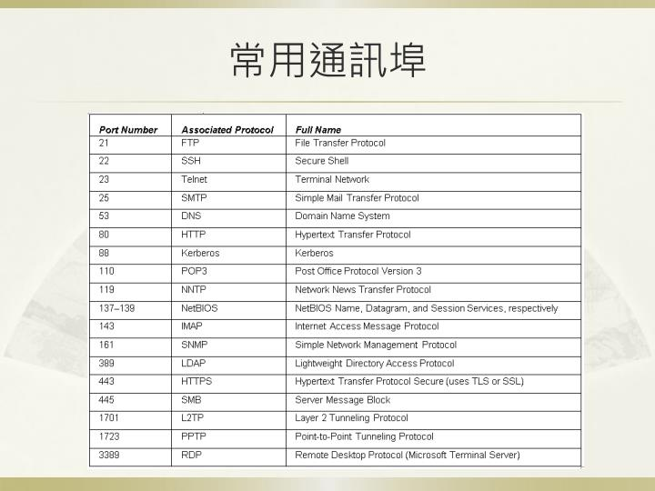

# computer netwokr計算機網路   網路概論

```
說明OSI Model與 TCP/IP protocol
```
https://www.pcnet.idv.tw/pcnet/network/network_ip_model.htm
##### OSI模型 (Open System Interconnection Model)
```
一種概念模型,由國際標準化組織提出,一個試圖使各種電腦在世界範圍內互連為網路的標準框架,定義於ISO/IEC 7498-1
```
分層|英文|中文|功能|位址|傳輸單位|裝置|各種協定
:-:|:-:|:-:|-|-|-|-|-|
7|Application Layer|應用層|**應用層直接和應用程式介面結合, 並提供常見的網路應用服務** |網域名稱系統(Domain Name System, DNS)|||FTP、HTTP、TELNET、SMTP、POP3、DNS、RAS、DHCP、LDAP...等
6|Presentation Layer|表現層|**字元編碼, 資料格式轉換, 壓縮與解壓縮, 加密與解密** 負責將傳入來的資料種類轉換成PC的資料種類,對資料進行壓縮和加密以提高速度和增加安全性 |||| ~該層被棄用。應用層的HTTP、FTP、Telnet等協定有類似的功能。傳輸層的TLS/SSL也有類似功能。~
5|Session Layer|會談層| **控制計算機之間的對話(連接), 允許程式以電腦名稱註冊成為網路上唯一的位址** 負責電腦之間的信息同步,維護連結,監測資料溝通狀態,並對錯誤信息做出處理|每台電腦在網際網路上都有一個位址,稱為**邏輯位址或 IP 位址** ||| ~該層被棄用。應用層的HTTP、RPC、SDP、RTCP等協定有類似的功能。~
4|Transport Layer|傳輸層|**進行資料的“分拆”和“打包, 如何控制節點間的傳遞﹐還有錯誤檢測和修正的方法**,資料的分割(Fragmentation)與重組(Reassembly),用**End-to-End** (端點對端點)連線(Connection),確保電腦資料正確的傳送到目的地|每個應用程式都會在網卡註冊一個埠號,該層就是埠與埠的通信,**通訊埠編號(port number)** |**一個區段(segment; TCP)** 、**一個使用者資料包(User Datagram; UDP)** 、**一個訊息(Message; SCTP)** ||**TCP(傳輸控制協定)** ,為三向交握（three-way handshake）,被稱為連接式協定、**UDP(用戶資料報協定)** ,被稱為非連接式協定 、**SCTP(串流控制傳輸協定)** ,為四向交握（four-way handshake）...等
3|Network Layer|網路層|**基於IP位址傳遞Packed, 根據路由演算法(Rorting Algorithm)選擇路徑**,負責 MAC 位址 和 網路位址(如 IP 位址﹑IPX 位址)之間的轉換|**IP位址(IP address)** 網際協定版本 IPv4 使用32位元（4位元組）位址、IPv6 使用128位元|**封包(Packed)** =IP 資料包(IP Datagram)(IP表頭+資料)|路由器(Router)、IP 交換機(IP Switch)| **IP(網際網路協定)** 、ICMP(網際網路控制訊息協定)、IPsec(網際網路安全協定)、PIP(路由資訊協定)...等
2|Data Link Layer|資料連結層|**框包的錯誤檢測, 傳送和接收順序與傳遞方式**,IEEE 802系列標準 將此層分為 **MAC(媒體訪問控制)** 與 **LLC(邏輯鏈路控制)** 子層,在LAN(區域網路)上面的信息單元被稱為 frame,每一個 frame 都會被賦予一個MAC位址 和偵錯監測值(checksum)| **MAC位址(Media Access Control Address,媒體存取控制層位址)** | **訊框(Frame)** (資料連結層標頭+資料+尾部(如果有的話))|網路卡(NIC)、橋接器(Bridge)| **ARP(位址解析協定)** 、PPP(對等協定)、NDP(鄰居發現協議)、STP(生成樹協定)...等
1|Physical Layer|實體層|**定義物理媒介在網路傳輸中的各種設備的訊號與電氣特性規格, 資料交換有單工、半雙工、全雙工模式** ,將硬體所攜載的信號轉換成電腦可以理解的電子信號(0 和 1)這通常都是設備上面之韌體(Firmware)的功能|不需要位址,其以廣播方式傳播|**位元(bit)**|光纖、雙絞線、同軸電纜、電話線(傳輸由快到慢),還有針腳、無線電、網路卡...等|
```
*封裝（encapsulation）在每層中,標頭（header）或是尾部（trailer）可加到資料單位裡
```
##### TCP/IP(TCP/IP Protocol Suite,TCP/IP協定套組)又被稱為TCP/IP協定疊（英語：TCP/IP Protocol Stack）
```
TCP/IP提供了點對點連結的機制,將資料應該如何封裝、定址、傳輸、路由以及在目的地如何接收,都加以標準化,它將軟體通訊過程抽象化為四個抽象層
```
分層|英文|中文|功能
:-:|:-:|:-:|-|
4|application layer|應用層|該層包括所有和應用程式協同工作,利用基礎網路交換應用程式專用的資料的協定,應用層是大多數普通與網路相關的程式為了通過網路與其他程式通訊所使用的層
3|transport layer|傳輸層|解決如 **端到端** 可靠性和保證資料按照正確的順序到達這樣的問題,在TCP/IP協定組中,傳輸協定也包括所給資料應該送給哪個應用程式
2|internetwork layer|網際網路層|	網路層解決在一個單一網路上傳輸封包的問題,牽涉到在網路組成的網上選擇路徑將封包傳輸
1|Network Access layer|網路存取層 |	它是封包從一個裝置的網路層傳輸到另外一個裝置的網路層的方法,這個過程能夠在網卡的軟體驅動程式中控制，也可以在韌體或者專用晶片中控制

# 協定protocol
```
何謂communications protocol[簡稱協定protocol]?
WHY Layering為何要分層?
```
```
1.通訊協定（Communication Protocol）定義電腦間互相通訊且受共同認定的協議標準,
  在一部電腦上可同時存在許多協定,並同時以不同的通訊協定和不同領域的電腦通訊
2.分層的原則是將來改變或更換某一層的通訊協定時,不會影響到其他層通訊協定的工作,
  層次不可太多,太多層的結構在整合的工作上較複雜且困難,
  相同功能之通訊協定歸於同一層,
  每一層之邊界只與上一層或下一層有關
```
## 各種協定
```
簡述下列協定protocol
須回答
(A)英文全名
(B)運作在那一層?
(C)主要功能
(D)相關工具或伺服器
```
### application層
```
HTTP vs HTTPS
FTP vs SFTP | FTPS
TELNET vs SSH
SMTP vs POP3 INAP 4

DNS vs DNSsec

DHCP

LDAP
SAMBA

SNMP

RTMP RTSP

MQTT
```

```
位於應用層:

HTTP(超文本傳輸協定)HyperText Transfer Protocol
  是一種用於分佈式、協作式和超媒體訊息系統的應用層協定,HTTP是全球資訊網的數據通信的基礎
  伺服器Google的Google Web Server
  標準通訊埠： 80 
HTTPS(超文本傳輸安全協定)HyperText Transfer Protocol Secure
  開發的主要目的，是提供對網站伺服器的身分認證，保護交換資料的隱私與完整性
  標準通訊埠： 443
FTP vs SFTP | FTPS
TELNET vs SSH
SMTP vs POP3 INAP 4

DNS vs DNSsec

DHCP

LDAP
SAMBA

SNMP

RTMP 即時訊息協定
RTSP

MQTT
```
### transport層
```
TCP 與UDP的差異
[1]須說明reliable(可靠) vs un-reliable(不可靠)
[2]如何達到reliable(可靠)
 (A)錯誤重傳
 (B) ThreeWay Handshaking
[3]封包格式 TCP format   vs UDP format
```

```
位於傳輸層:
TCP (Transmission Control Protocol,TCP傳輸控制協定) 可靠,穩定,但慢
UDP (Transmission Control Protocol,UDP傳輸控制協定) 不可靠,不穩定,但快
[1]
TCP的可靠
  在傳遞數據之前,會有三次握手來建立連接，在數據傳遞時檢驗和(checksum)、確認(Acknowledgment)、重送(retransmission)、擁塞控制機制,在數據傳完後,還會斷開連接用來節約系統資源
UDP的不可靠
  在傳遞數據時，如果網絡質量不好，就會很容易丟包
[2]
(A)錯誤重傳
  一旦連線建立，TCP 以 區段 (segment) 的交換來傳遞資料,接收端 可能因「檢驗和測試失敗」,認定區段毀損並丟棄,或 網路壅塞… 等因素,而遺失區段,TCP 使用 重送 (Retransmission) 機制,確保每個 區段 的傳遞
(B) ThreeWay Handshaking
  三向交握 (Three-way Handshake),是其建立虛擬連線 (virtual connection) 的方式,又稱為 三向式握手、三路交握 …,其實就是 三次訊息的交換
[3]
TCP區段(TCP segment)
UPD資料包(User Datagram)
```
```
IP vs IPsec
ICMP
```
```
位於傳輸層:
IP(網際網路協定)Internet Protocol
  是用於封包交換資料網路的一種協定
IPsec(網際網路安全協定)Internet Protocol Security
  是一個協定套件，透過對IP協定的封包進行加密和認證來保護IP協定的網路傳輸協定族
ICMP(網際網路控制訊息協定)Internet Control Message Protocol
  是網際網路協定套組的核心協定之一,它用於網際網路協定（IP）中傳送控制訊息,提供可能發生在通訊環境中的各種問題回饋,通過這些資訊,使管理者可以對所發生的問題作出診斷,然後採取適當的措施解決
```
### 連結層
```
ARP
```
```
位於連結層:
ARP(位址解析協定)Address Resolution Protocol
  是一個通過解析網路層位址來找尋資料鏈路層位址的網路傳輸協定，它在IPv4中極其重要
  ARP spoofing (ARP欺騙,又稱ARP毒化/ARP病毒/ARP攻擊)針對"乙太網路位置解析協定(ARP)"的攻擊技術，可讓攻擊者取得/或竄改"區域網路"上的資料封包,且可讓特定電腦或所有電腦無法正常連線
  ARP欺騙亦有正當用途:
  1.在需要登入的網路中,讓位登入的電腦將其瀏覽網頁強制轉到登入頁面
  2.設有"備援機制"的網路裝置或伺服器,利用ARP欺騙以在裝置出現故障時，將訊務導到備用的裝置上
```
# 網路硬體設備 Network Devices
```
簡述底下網路設備:須說明
(A)運作在OSI那一層?
(B)主要功能

(1) HUB  vs Repeater
(2) Switch vs Bridge
(3) Router
(4) L4 Switch
(5) Proxy 
```
```
(1) HUB  vs Repeater
(2) Switch vs Bridge
(3) Router
(4) L4 Switch
(5) Proxy 
```
```
名詞解釋: VLAN
```
```
位於網路層的交換機:
VLAN(虛擬區域網)Virtual Local Area Network
  是一種建構於區域網路交換技術（LAN Switch）的網路管理的技術,網管人員可以藉此透過控制交換器有效分派出入區域網的封包到正確的出入埠,達到對不同實體區域網中的裝置進行邏輯分群（Grouping）管理,並降低區域網內大量資料流通時,因無用封包過多導致壅塞的問題,以及提昇區域網的資訊安全保障

```
# 各種address位址
```
PORT address
IP address
MAC address
```
```
位於傳輸層:
Port number(通訊埠編號)
  在電腦網路中是一種經由軟體建立的服務,在一個電腦作業系統中扮演通訊的端點（endpoint）,每個通訊埠都會與主機的IP位址及通訊協定關聯
  
位於網路層:
IP address(IP位址)
  用於標識傳送或接收資料報的裝置的一串數字
  
位於資料連結層:
MAC Address(MAC位址)Media Access Control Address
  是一個用來確認網路裝置位置的位址,MAC位址用於在網路中唯一標示一個網卡,一台裝置若有一或多個網卡,則每個網卡都需要並會有一個唯一的MAC位址
```
