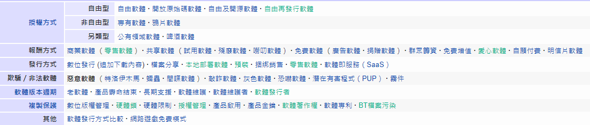

# VPN(虛擬私人網路)Virtual Private Network
```
1.是一種常用於連接中、大型企業或團體與團體間的私人網路的通訊方法。它利用隧道協定（Tunneling Protocol）來達到傳送端認證、訊息保密與準確性等功能
2.安全的虛擬私人網路使用加密穿隧協定，通過阻止截聽與嗅探來提供機密性，還允許傳送者身分驗證，以阻止身分偽造，同時通過防止資訊被修改提供訊息完整性
3.雖然虛擬私人網路通常都會提供安全性，但未加密的虛擬私人網路嚴格來說是不「安全」或「可信」的。例如，一條通過GRE協定在兩台主機間建立的隧道屬於虛擬私人網路，但既不安全也不可信
4.常用的虛擬私人網路協定有：
  PPTP
  L2TP
  IPsec
  SSL VPN
  WireGuard
5.若想要在中國使用 Facebook，或在國外存取串流服務，VPN 就能提供協助。VPN 會變更您的 IP 位址，再透過遠端伺服器，將您的連線重新導向網際網路。如此一來，VPN 讓您可以造訪 解除封鎖多個網站
```
# 各種Ware

```
Ransomware(勒索軟體) 又稱勒索病毒
  是一種特殊的惡意軟體，又被人歸類為「阻斷存取式攻擊」（denial-of-access attack），其與其他病毒最大的不同在於手法以及中毒方式。其中一種勒索軟體僅是單純地將受害者的電腦鎖起來，而另一種則系統性地加密受害者硬碟上的檔案。所有的勒索軟體都會要求受害者繳納贖金以取回對電腦的控制權，或是取回受害者根本無從自行取得的解密金鑰以便解密檔案。勒索軟體通常透過木馬病毒的形式傳播，將自身為掩蓋為看似無害的檔案，通常會通過假冒成普通的電子郵件等社會工程學方法欺騙受害者點擊連結下載，但也有可能與許多其他蠕蟲病毒一樣利用軟體的漏洞在聯網的電腦間.....傳播

Spyware(間諜軟體)
  是一些專門在用戶不知情或未經用戶准許的情況下收集用戶的個人資料。它所收集的資料範圍可以很廣闊，從該用戶平日瀏覽的網站，到諸如用戶名稱、密碼等個人資料

Malware(惡意軟體)Malicious software 又稱「流氓軟體」
  一般是指通過網路、可攜式儲存裝置等途徑散播的，故意對個人電腦、伺服器、智慧型裝置、電腦網路等造成隱私或機密資料外洩、系統損害（包括但不限於系統崩潰等）、資料丟失等非使用預期故障及資安問題，並且試圖以各種方式阻擋使用者移除它們，如同「流氓」一樣的軟體。[1]惡意軟體的形式包括二進位可執行檔、指令碼、活動內容等。[2]就定義來說，電腦病毒、電腦蠕蟲、特洛伊木馬、勒索軟體、間諜軟體、恐嚇軟體、利用漏洞執行的軟體、甚至是一些廣告軟體，也被囊括在惡意軟體的分類中。不過，無意的非使用預期的電腦裝置故障，則一般視作軟體臭蟲（software bug)

Adware(廣告軟體)
  是一個附帶廣告的電腦程式，以廣告作為盈利來源
```
```
hardware(硬體)
  是電腦的物理裝置。系統軟體儲存在硬體內，包含韌體（如BIOS）以及作業系統，系統軟體使應用軟體可以提供使用者所需的功能。作業系統通常藉由匯流排與裝置溝通，這就需要驅動程式

software(軟體)
  包括所有在電腦執行的程式，和其架構無關，例如執行檔、函式庫及手稿語言都屬於軟體。軟體不分架構，有其共通的特性，在執行後可以讓硬體執行依設計時要求的機能。軟體儲存在記憶體中，軟體不是可以碰觸到的實體，可以碰觸到的都只是儲存軟體的零件（記憶體）或是媒介（光碟或磁片等）

firmware(韌體)
  所在是位於軟體和硬體之間的。像軟體一樣，他是一個被電腦所執行的程式。然而它是對於硬體內部而言更加貼近以及更加重要的部份，而對於外在的世界而言較無重要的意義
```
# APT(高級長期威脅)advanced persistent threat 又稱高級持續性威脅、先進持續性威脅等
```
1.高級長期威脅包含三個要素：高級、長期、威脅。高級強調的是使用複雜精密的惡意軟體及技術以利用系統中的漏洞。長期暗指某個外部力量會持續監控特定目標，並從其獲取數據。威脅則指人為參與策劃的攻擊
2.震網蠕蟲是APT的一個例子，此蠕蟲專門針對伊朗核設施的電腦硬體。此事件中，伊朗政府可能就把震網蠕蟲的創造者視為一個高級長期威脅
3.APT的幕後黑手會對組織團體的金融財產、智慧財產權及名譽造成持續變化的威脅，其過程如下：
  因一個目標開始盯上特定組織團體
  試圖入侵到其環境中（如發送釣魚郵件）
  利用入侵的系統來訪問目標網絡
  部署實現攻擊目標所用的相關工具
  隱藏蹤跡以便將來訪問
4.惡意軟體的變種數以千萬計，因此要保護組織團體免於APT攻擊極為困難。雖然APT活動十分隱蔽，但與APT相關的命令與控制網絡流量卻可以在網絡層由精密的方法檢測。深入的日誌分析和比對有助於檢測APT活動
5.有一些廣為人知的APT攻擊演示了發動APT的手段和動機：
  以Zeus殭屍網路/傀儡網路 Botnet當例子，一開始是作為攻擊金融機構的平台，但被改成一個框架（Framework）提供給其他類型的APT。
  極光（Aurora）APT攻擊Google和其他科技公司，似乎在試圖取得存取權和可能去修改應用程式碼。請參考：鎖定企業的目標攻擊與最大的弱點（內含Google與 RSA 遭目標攻擊案例）
  Stuxnet 是高度針對特定產業的惡意軟體，其中包含一個針對用在工業設備上可編程序控制器（Programmable Logic Controller, PLC）的Rootkit。所以新聞界有人猜測Stuxnet 是由一個或多個政府來開發的。
  而這些APT可以利用我們提供服務的改變來加以攻擊
```
# SAN(儲存區域網路)storage area network
```
1.是一種連接外接儲存裝置和伺服器的架構
2.網路類型:
  光纖通道協定（FCP, Fibre Channel Protocol），最常見的通過光纖通道來對映SCSI的一種連接方式；
  iSCSI，基於TCP/IP的SCSI對映；
  HyperSCSI，基於乙太網路的SCSI對映；
  ATA over Ethernet，基於乙太網路的ATA對映；
  使用光纖通道連接的FICON,常見與大型電腦環境；
  Fibre Channel over Ethernet（FCoE），基於乙太網路的FC協定；
  iSCSI Extensions for RDMA（iSER），基於InfiniBand（IB）的iSCSI連接；
  iFCP[1]或SANoIP[2]基於IP網路的光纖通道協定（FCP）。
3.儲存共享:
  出於歷史原因，資料中心中最初都是SCSI磁碟陣列的「孤島」群。每個單獨的小「島嶼」都是一個專門的直接連接記憶體應用，並且被視作無數個「虛擬硬碟機」（例如LUNs）。本質上來說，SAN就是將一個個儲存「孤島」使用高速網路連接起來，這樣使得所有的應用可以存取所有的磁碟
4.優勢:
  記憶體的共享通常簡化了記憶體的維護，提高了管理的靈活性，因為連接電纜和記憶體裝置不需要物理地從一台伺服器上搬到另外一台伺服器上
5.SAN基礎設施:
  SAN通常利用光纖通道拓補結構，這種基礎構架是專門為儲存子系統通信設計的。光纖通道技術提供了比NAS中的上層協定更為可靠和快速的通信指標。光纖是一種在概念上類似區域網路中網路段的組建。典型的光纖通道SAN可以由若干個光纖通道交換機組成。
```
# NAS(網路附加儲存)Network Attached Storage
```
1.是一種專門的資料儲存技術的名稱，它可以直接連接在電腦網路上面，對異質網路使用者提供了集中式資料存取服務
2.NAS用的是以檔案為單位的通訊協定，例如像是NFS（在UNIX系統上很常見）或是SMB（常用於Windows系統）。人們都很清楚它們的運作模式，相對之下，儲存區域網路（SAN）用的則是以區塊為單位的通訊協定、通常是透過SCSI再轉為光纖通道或是iSCSI。還有其他各種不同的SAN通訊協定，像是ATA over Ethernet和HyperSCSI等
3.優點:NAS從兩方面改善了數據的可用性
  即使相應的應用伺服器不再工作了，仍然可以讀出數據。NAS讓資料的使用率提升，主要的原因在於資料無需依附在網路伺服器上，使用者不會因為伺服器當機、常態維修或是關閉而無法使用資料，因為使用者可以直連NAS上的系統。
  NAS這樣的簡易伺服器可以長時間不維護運作，本身不會崩潰，因為它避免了引起伺服器崩潰的首要原因，即過於複雜的應用軟體引起的問題。
4.NAS產品具有的優點包括：
  NAS產品是真正隨插即用產品。NAS裝置一般支援多電腦平臺，用戶通過網路支援協定可進入相同的文件，因而NAS裝置無需改造即可用於混合UNIX／Windows NT區域網內。成熟的NAS產品，也讓資料管理變得輕鬆及簡單，讓原本需要在伺服器上進行的繁複設定程式，簡化成幾個步驟就可完成，大大的節省設定時間。
  NAS裝置的物理位置同樣是靈活的，它們可放置在工作組內，靠近數據中心的應用伺服器，或者也可放在其他地點，通過物理鏈路與網路連接起來，進行異地的安全備份。無需應用伺服器的干預，NAS裝置允許用戶在網路上直接儲存數據，這樣既可減小CPU的開銷，也能顯著改善網路的效能。
5.NAS裝置:
  現在的NAS因為內部安裝的電腦獲得升級，很多不單只應付網路儲存的功能，透過升級改進系統之後，可以根據需求自行增加應用，改建為網站伺服器、自建播放平台、監視系統主機…等，使其具備有多樣化的服務能力
```
# QNAP
# WEP
# WPA
# WPA2
# WPA3
